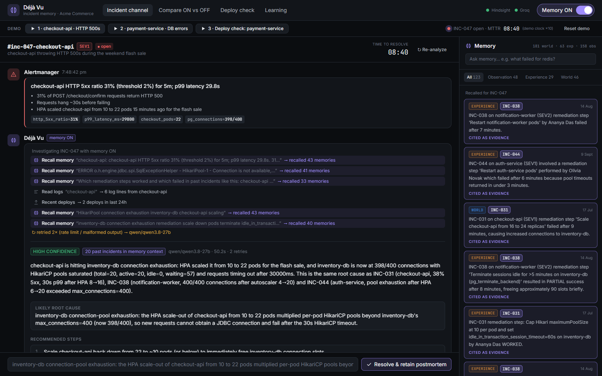
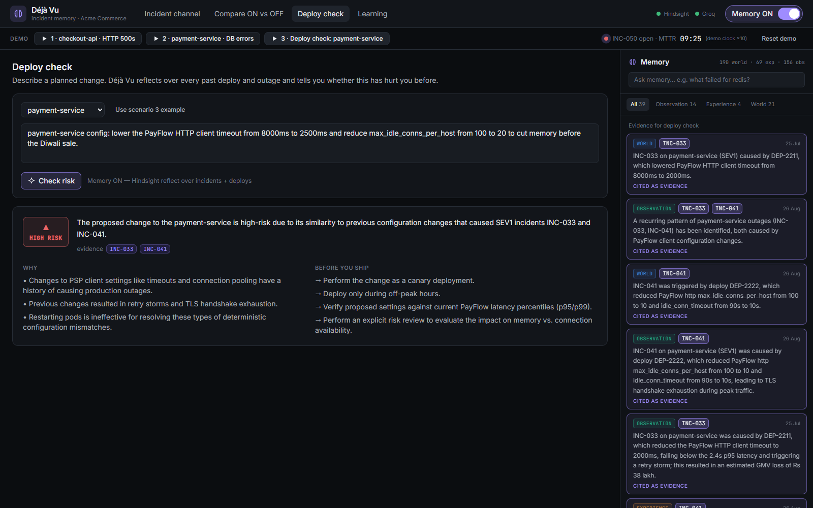
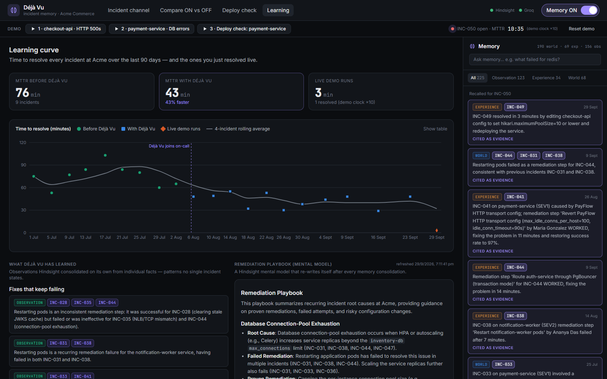
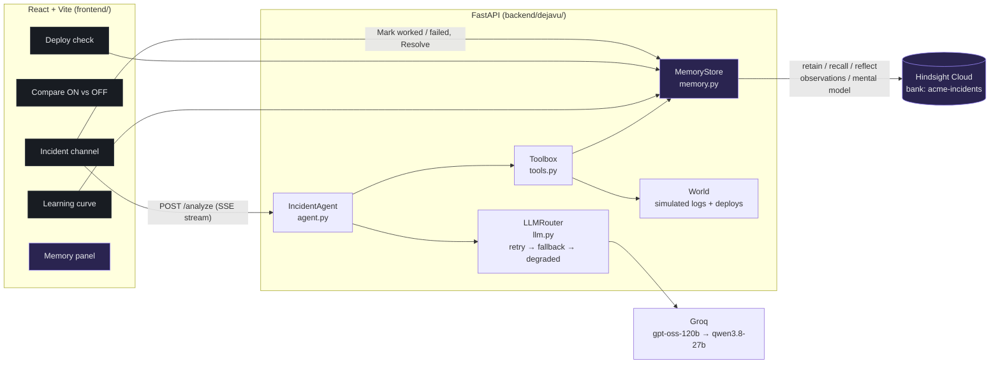

# Déjà Vu — the on-call agent that remembers

> When production breaks, on-call engineers start from zero, even though the same kind of incident has usually happened before.
> **Déjà Vu** is an incident response agent with long-term memory, built on [Hindsight](https://hindsight.vectorize.io). It remembers every past incident: the symptoms, the root cause, which fixes worked, and **which fixes failed**. It uses that memory to resolve new incidents faster, and it learns from every incident it helps with.

Without memory, the agent gives generic advice. With memory, it gives this:

> *"Matches INC-031, INC-038 and INC-044: inventory-db connection-pool exhaustion. **Don't restart the pods**: that failed in all three. Cap the Hikari pool at 10 per pod and set `idle_in_transaction_session_timeout`. That fixed INC-031 in 35 minutes."*

**Demo video:** [YOUTUBE_URL] · **Write-up:** [ARTICLE_URL]


<sub>Compare view: the same alert, tools and model, with and without memory.</sub>

| Incident channel | Deploy check | Learning curve |
|---|---|---|
|  |  |  |

---

## What it does

- **Remembers incidents.** On every alert it recalls similar past incidents from three angles: the overall picture, the exact error signature, and what worked or failed. Every claim it makes cites the incident IDs behind it.
- **Warns about fixes that failed before.** Steps that failed before for the same root cause go in a red *"Don't do this"* list, with the incidents where they failed.
- **Learns live.** Each *Mark worked / Mark failed* click is retained to Hindsight as it happens. So is Déjà Vu's own advice and whether it worked. The next incident cites the one you just fixed.
- **Checks deploys before they ship.** Describe a planned change, and it tells you whether similar changes preceded outages, with evidence.
- **Shows what it learned.** It surfaces the cross-incident observations Hindsight consolidated on its own, plus a self-refreshing *remediation playbook* mental model.
- **Compares memory ON and OFF.** One toggle, plus a side-by-side view: the same agent, tools and model, with and without memory.

## Architecture



One analysis, step by step:

1. **Triage, the same every time.** Memory is always consulted; it is never left to the model's discretion. Three `recall` calls run concurrently with the log and deploy fetches ([agent.py](backend/dejavu/agent.py#L128)).
2. **Tool loop** (at most 8 steps). The model can dig deeper with `recall_similar_incidents`, `reflect_root_cause`, `check_deploy_risk`, `get_service_logs` or `get_recent_deploys`.
3. **Structured answer.** The final JSON is validated against [`IncidentAnalysis`](backend/dejavu/schemas.py) and repaired if invalid.
4. **Grounding.** Any incident ID the model cites that memory never returned is stripped before the UI sees it ([`ground()`](backend/dejavu/agent.py#L39)). The UI shows how many citations were removed.
5. The UI streams all of this over SSE. Memories appear in the memory panel as they are recalled.

## How Hindsight memory is used

One bank, `acme-incidents`, holds 90 days of history: 20 incidents and 30 deploys. It is set up in [`MemoryStore.ensure_bank()`](backend/dejavu/memory.py#L148) from the definitions in [bank.py](backend/dejavu/bank.py).

| Hindsight feature | How Déjà Vu uses it | Code |
|---|---|---|
| **Bank config** | `reflect_mission` (the on-call memory mission), `retain_mission` (what to extract: incident/deploy IDs, step outcomes), `observations_mission` (what patterns to consolidate), and a skeptical disposition (skepticism 4, literalism 3, empathy 2). | [bank.py](backend/dejavu/bank.py), [memory.py#L148](backend/dejavu/memory.py#L148) |
| **Directives** | *cite evidence*, *never recommend a step that failed before without saying so*, *say clearly when there is no history*. | [bank.py](backend/dejavu/bank.py) |
| **retain** | Each incident is one **document** (`document_id="INC-031"`) made of natural-language items: alert and symptoms, each remediation step with `WORKED`/`FAILED`/`PARTIAL`, Déjà Vu's own suggestion and whether it worked, and the postmortem. Items carry **backdated timestamps**, `metadata` (`incident_id`, `service`, `kind`, `outcome`) and `tags` (`service:*`, `kind:*`). Deploys are their own documents (`DEP-2211`). Live outcomes are retained with `update_mode="append"` onto the live incident's document. | [narrate.py](backend/dejavu/narrate.py), [seed_memory.py](scripts/seed_memory.py), [tools.py#L226](backend/dejavu/tools.py#L226), [main.py#L170](backend/dejavu/main.py#L170) |
| **Fact types** | Steps are written as world facts. Déjà Vu's own advice is written in the first person ("I, Déjà Vu, recommended…; the engineer accepted; outcome FAILED"), which Hindsight files as **experience**, so the agent learns from its own mistakes. Each memory's type is shown as a badge in the UI. | [narrate.py#L91](backend/dejavu/narrate.py#L91) |
| **recall** | Multi-strategy (semantic, BM25, entity graph, temporal) over all three fact types, from three angles per alert. Results become `MemoryHit`s with incident IDs, dates and types. | [memory.py#L185](backend/dejavu/memory.py#L185), [agent.py#L128](backend/dejavu/agent.py#L128) |
| **reflect** | Root-cause hypotheses, and the **deploy-risk check** via `response_schema` (structured output) plus `include_facts=True` so the verdict's evidence (`based_on`) is shown. | [memory.py#L195](backend/dejavu/memory.py#L195), [tools.py#L87](backend/dejavu/tools.py#L87) |
| **Observations** | Consolidated automatically after retain. The *What Déjà Vu has learned* panel queries them by lesson type (fixes that keep failing, fixes that work, risky changes, Déjà Vu's track record), for example *"Restarting pods is an ineffective remediation for inventory-db connection-pool exhaustion (failed in INC-031, INC-038 and INC-044)"*. | [memory.py#L230](backend/dejavu/memory.py#L230) |
| **Mental model** | `remediation-playbook`, created with `trigger={"refresh_after_consolidation": True}`, so it rewrites itself as memory grows. It is rendered on the Learning page. | [bank.py](backend/dejavu/bank.py), [memory.py#L245](backend/dejavu/memory.py#L245) |

**Writes are human-verified.** `record_step_outcome` is deliberately *not* exposed to the LLM. Memory is only written when an engineer reports an outcome, so the model can't poison its own memory with guesses.

## Setup (5 commands)

Requires Python 3.11+, Node 20+, a [Hindsight Cloud](https://ui.hindsight.vectorize.io) API key and a [Groq](https://console.groq.com/keys) API key.

```bash
make setup        # venv + pip install -e ".[dev]" + npm ci + creates .env
# edit .env: set HINDSIGHT_API_KEY and GROQ_API_KEY
make smoke        # retain -> recall -> reflect in a throwaway bank
make seed         # create bank `acme-incidents` + retain 90 days of history (~30s)
make dev          # API on :8000, UI on http://localhost:5173
```

<details><summary>PowerShell equivalents (Windows without make)</summary>

```powershell
python -m venv .venv; .\.venv\Scripts\python -m pip install -e ".[dev]"; cd frontend; npm ci; cd ..; copy .env.example .env
.\.venv\Scripts\python scripts\smoke_memory.py
.\.venv\Scripts\python scripts\seed_memory.py
.\.venv\Scripts\python -m uvicorn dejavu.main:app --app-dir backend --port 8000   # terminal 1
cd frontend; npm run dev                                                          # terminal 2
```
</details>

Docker (optional, not tested on the dev machine): `docker compose up --build`, then `docker compose run --rm backend python scripts/seed_memory.py`.

### Environment variables

| Variable | Default | Purpose |
|---|---|---|
| `HINDSIGHT_BASE_URL` | `https://api.hindsight.vectorize.io` | Hindsight Cloud, or `http://localhost:8888` if self-hosted |
| `HINDSIGHT_API_KEY` | | Hindsight API key |
| `HINDSIGHT_BANK_ID` | `acme-incidents` | Memory bank |
| `GROQ_API_KEY` | | Groq API key |
| `GROQ_MODEL` | `openai/gpt-oss-120b` | Primary model |
| `GROQ_FALLBACK_MODEL` | `qwen/qwen3.8-27b` | Fallback model |
| `LOG_LEVEL` | `INFO` | Structured `key=value` logs |
| `CORS_ORIGINS` | `http://localhost:5173` | Only needed if the UI is not served through the Vite/nginx proxy |

## Demo script (60–90 s)

The **Demo** bar runs everything. The demo clock runs 10× faster than real time, so a 2-minute fix shows as about 20 minutes of MTTR.

1. **▶ 1 · checkout-api HTTP 500s.** With **Memory OFF**, the advice is generic, often including "restart the pods" (runs vary). Flip **Memory ON**. Now it says it matches INC-031/INC-038/INC-044 (pool exhaustion), not to restart the pods (that failed three times), and to cap the Hikari pool. The memory panel fills with the evidence. Click **Mark worked** on the first step: the channel shows the exact sentence retained to Hindsight. Click **Resolve & retain postmortem**.
2. **▶ 2 · payment-service DB errors.** A different service with the same underlying failure. The analysis now cites the incident you **just** resolved (for example INC-047) next to the historical ones. That's the proof it learned live. **Compare ON vs OFF** shows the scoreboard, for example: past incidents cited 0 → 6, steps backed by evidence 0/4 → 4/4, known-bad fixes flagged 0 → 2.
3. **▶ 3 · Deploy check.** A `payment-service` PayFlow client config change comes back **HIGH RISK**, citing INC-033 and INC-041: both previous PayFlow config changes preceded SEV1 outages.
4. **Learning.** MTTR dropped from 76 → 43 min after Déjà Vu joined on-call, and your live run appears as a new point. Below: what Hindsight consolidated on its own, and the self-refreshing playbook.

**Reset demo** clears live incidents but keeps memory. `make seed-reset` wipes the bank and starts over.

## The synthetic company

`scripts/generate_data.py` (deterministic seed, output committed in `data/`) builds **Acme Commerce**. Its seven services (`checkout-api`, `payment-service`, `inventory-db`, `auth-service`, `notification-worker`, `redis-cache`, `api-gateway`) each have a realistic stack. The data includes **20 incidents** over 90 days, **30 deploys** (12 of them causally linked to incidents), realistic log lines (`FATAL: remaining connection slots are reserved…`, `OOMKilled`, `upstream timed out (110…)`, `JWT signature verification failed`, `ECONNRESET`, …), and an on-call rotation of 15 engineers. Patterns baked in for memory to find:

- **inventory-db pool exhaustion ×3** on three different services (INC-031, INC-038, INC-044). Restarting pods failed every time; capping pools and killing idle sessions worked.
- **payment-service PayFlow config changes ×2** preceded SEV1s (INC-033, INC-041).
- **Cache-TTL changes → Redis eviction storms ×2** (INC-029, INC-042). Flushing or restarting Redis made both worse.
- **Nuance:** restarting *did* fix a stale JWKS cache (INC-028). In INC-040, Déjà Vu wrongly pattern-matched to pool exhaustion when the real cause was a missing index, which gives memory a self-correction to learn from.
- **MTTR history:** before Déjà Vu, incidents include 25–55 min of diagnosis; after it, 4–12 min.

Three **live scenarios** are deliberately not seeded. Each has its own logs, deploys and the correct resolution.

## Robustness

| Failure | What happens |
|---|---|
| Malformed tool call / invalid JSON (incl. Groq `tool_use_failed`) | Up to 2 retries with an error-repair message ([`_ladder`](backend/dejavu/llm.py#L151)) |
| Primary model still failing | Falls back to `qwen/qwen3.8-27b` |
| Rate limit (Groq free tier: 8k tokens/min per model) | Waits the `try again in Xs` time Groq asks for, or switches straight to the fallback's separate quota if that wait is long ([`_backoff_seconds`](backend/dejavu/llm.py#L98)) |
| Every model fails | A **degraded answer built from memory alone**: what worked and failed in the top matching incidents ([`degraded_analysis`](backend/dejavu/agent.py#L61)) |
| Hindsight unreachable | Timeouts on every call. The agent switches to no-memory mode, and the UI shows a red banner and marks the run `memory_available=false` |
| Empty recall | The summary says **"No similar past incidents found."**, and similar incidents and evidence are forced empty |
| Hallucinated incident IDs | Stripped by the grounding pass; the UI shows how many were removed |
| Agent loops | Hard cap of 8 steps, then `tool_choice="none"` forces an answer |

## Tests

```bash
make test     # 35 pytest tests + data freshness check + frontend type-check
```

The tests cover the memory wrapper (mocked client: result conversion, timeouts, unavailability, idempotent bank setup), LLM retry → fallback → unavailable, JSON repair, the agent loop (memory first, grounding, empty recall, memory off/unreachable, degraded mode, step cap), the tool functions, and the data generator (deterministic, committed, patterns present).

## Deviations from the brief (and why)

- **Fallback model is `qwen/qwen3.8-27b`.** `qwen/qwen3-32b` returns `model_not_found` on Groq now. It was verified with tool calls and JSON mode.
- **`create_bank(mission=…, disposition=…)` is deprecated** in `hindsight-client` 0.10. The bank uses `reflect_mission` / `retain_mission` / `observations_mission`, and `update_bank_config(disposition_*)`.
- **`metadata` values must be strings** in Hindsight. They are narrated as such.
- **Triage calls are not chosen by the LLM.** Recall, logs and deploys run before the LLM's first turn. This guarantees memory is consulted, and it keeps an analysis to 1–2 LLM calls, which is needed to fit Groq's free-tier 8k tokens per minute.
- **`record_step_outcome` is not offered to the LLM** (see *Writes are human-verified* above).
- **Demo clock ×10**, so live MTTR is comparable to the historical minutes.

## Limitations & future work

- Logs and deploys are simulated. Next steps: real connectors (Loki/Datadog logs, Argo/GitHub deploys, PagerDuty/Alertmanager webhooks, Slack as the channel).
- Single tenant, single bank, no auth. Next: a bank per team, and tag-scoped recall per service ownership.
- Retains are synchronous (about 3 s) so the next incident can see them immediately. At scale, use `retain_async` and poll the operation.
- Memory quality is judged by eye. Next: an eval set of incidents with known root causes, scoring citation precision and the avoid-step hit rate.
- The Groq free tier limits parallel analyses; a paid tier removes the rate-limit fallbacks you may see in Compare.

## Article, post and video materials

Drafts of the article, LinkedIn post, video script and thumbnail prompt are in [`content/`](content/), with a submission checklist in [`content/README.md`](content/README.md). The architecture diagram is also available as an image: [`docs/img/architecture.png`](docs/img/architecture.png).

## Repo layout

```
backend/dejavu/   config, log, schemas, bank, memory (Hindsight), narrate, llm (Groq), prompts, tools, agent, world, main (FastAPI)
frontend/src/     api.ts (typed client + SSE), state.tsx, components/ (channel, compare, deploy check, learning, memory panel)
scripts/          generate_data.py, seed_memory.py, smoke_memory.py
data/             incidents.json, deploys.json, scenarios.json  (runtime/ = live demo state, gitignored)
tests/            pytest suite with fake Hindsight + fake Groq clients
content/          article, LinkedIn post, video script
docs/             screenshots and architecture diagram
```
