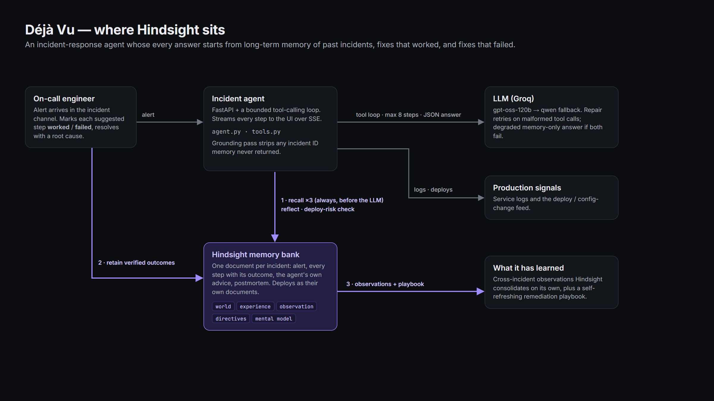
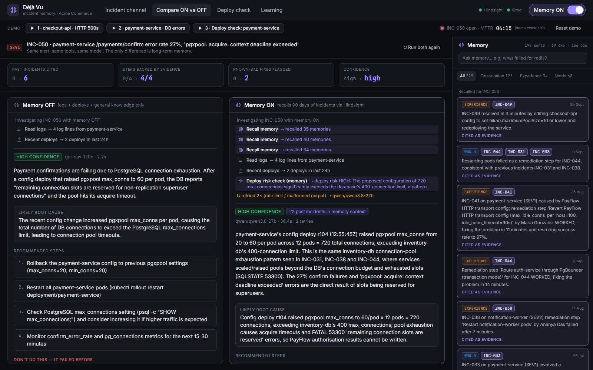
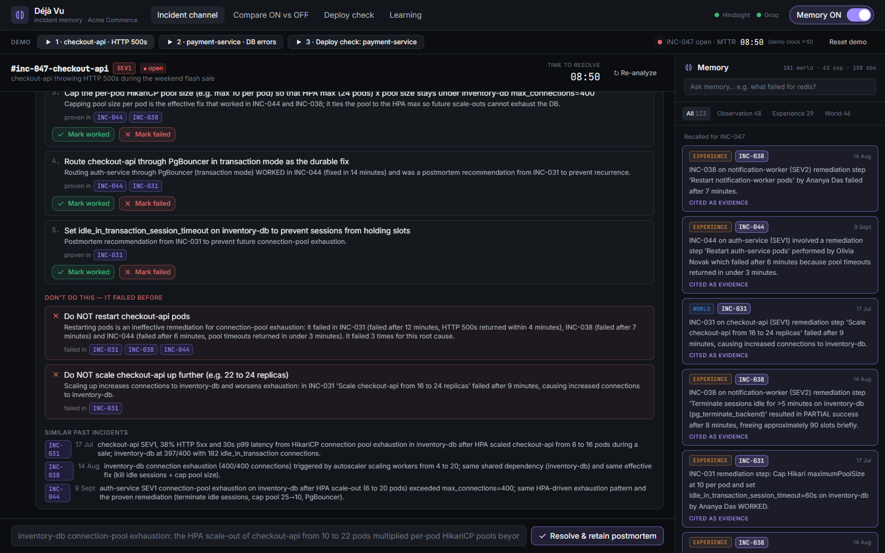
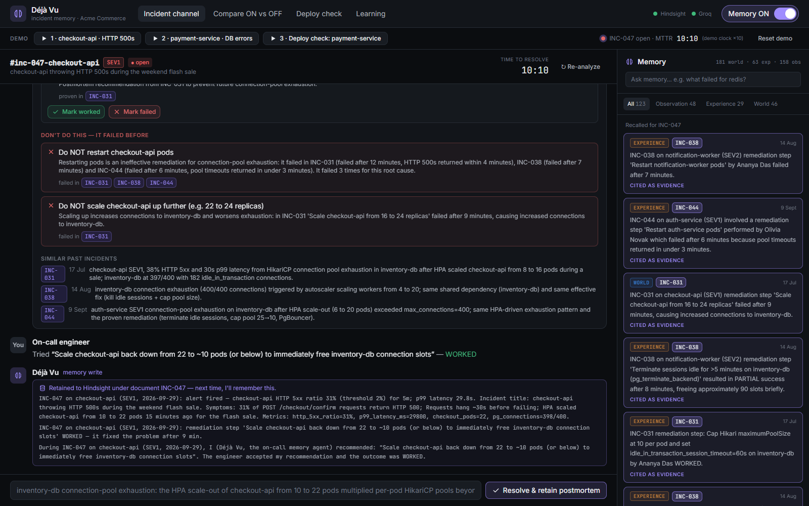

# Restarting pods failed three times. Hindsight made my agent notice.

The worst advice an on-call assistant can give isn't wrong advice. It's advice that already failed last month, delivered with total confidence to a tired engineer at 2 a.m.

I built an incident-response agent, and the first version did exactly that. A `checkout-api` alert fired: HTTP 500s, `HikariPool-1 - Connection is not available`, and Postgres refusing clients with `FATAL: remaining connection slots are reserved`. The agent read the logs, correctly spotted connection-pool exhaustion, and then recommended step four: *"Restart the checkout-api pods to apply the new pool size and clear any stuck connections."*

Our incident history had already tried that three times, on three different services, for this exact root cause. Every time, the errors came back within minutes because the fresh pods refilled their pools. The agent had no way to know. Each incident started from zero.

So I gave it memory. This post covers how I wired [Hindsight agent memory](https://github.com/vectorize-io/hindsight) into the agent, the design decisions that mattered, and what changed.



## What the system does

The agent is called Déjà Vu. When an alert fires, it posts into an incident channel and streams its investigation as it goes:

1. It recalls similar past incidents from Hindsight.
2. It reads the service's recent logs and the deploy/config-change feed.
3. It optionally digs deeper with more recall, a reflect call over the whole memory bank, or a deploy-risk check.
4. It returns a structured answer: likely root cause, recommended steps, **steps to avoid**, and similar past incidents. Every claim that comes from history cites the incident IDs behind it.

The engineer clicks *Mark worked* or *Mark failed* on each step and resolves the incident with a root cause. Every click is retained back into Hindsight on the spot, so the next incident can use it.

The stack is FastAPI with a bounded tool-calling loop (max 8 steps), Groq for the LLM (`gpt-oss-120b`, falling back to a Qwen model), and React for the console. Hindsight holds one memory bank for the whole on-call team.

## The core decision: failures are first-class memory

Most "agent memory" demos store what worked. What an on-call engineer most needs, though, is often the opposite: what *not* to do. The fix that wastes 12 minutes and makes the outage worse is the one worth remembering.

So every remediation step is retained as its own sentence, with an explicit outcome:

```python
def step_item(*, incident_id, service, severity, when, action, outcome, minutes=None, notes="", by=None):
    outcome = outcome.upper()
    who = f" by {by}" if by else ""
    took = f" after {minutes} min" if minutes else ""
    text = (f"{_header(incident_id, service, severity, when)}: remediation step '{action}'{who}"
            f" {OUTCOME_PHRASES.get(outcome, 'Outcome: ' + outcome)}{took}.")
    ...
```

That produces memories like *"INC-031 on checkout-api (SEV1, 2026-07-17): remediation step 'Restart checkout-api pods' did NOT fix the problem. Outcome: FAILED after 12 min."*

Two things turned out to matter a lot here.

**Every sentence repeats its own context.** Incident ID, service, severity and date are in every retained item. Hindsight extracts facts from free text, so when a fact is later recalled out of context, it still carries its own evidence. The agent can cite `INC-031` because the fact itself says `INC-031`. Each incident is also one Hindsight *document* (`document_id="INC-031"`) with backdated timestamps, metadata and `service:`/`kind:` tags, which keeps temporal recall and filtering honest.

**The agent's own advice is written in the first person.** This one surprised me the most:

```python
def agent_suggestion_item(*, incident_id, service, severity, when, suggestion, accepted, outcome, notes=""):
    verdict = "accepted" if accepted else "did not follow"
    text = (f"During {_header(incident_id, service, severity, when)}, I (Déjà Vu, the on-call memory agent)"
            f" recommended: \"{suggestion}\". The engineer {verdict} my recommendation and the outcome was {outcome.upper()}.")
```

Hindsight separates *world* facts (what happened) from *experience* facts (what the agent itself did). Writing the agent's suggestions in the first person means they land as experience. The agent keeps a track record of its own advice, including the time it pattern-matched an incident to pool exhaustion when the real cause was a dropped index. That self-correction is now in memory too.

## Never let the model decide whether to remember

My first loop exposed recall as a tool and let the LLM decide when to call it. Sometimes it didn't. It would read the logs, feel confident, and answer from general knowledge. That's precisely the failure I was trying to fix.

Now memory is consulted before the model ever speaks, from three angles at once:

```python
triage.append(("recall_similar_incidents", {"symptoms": prompts.recall_query(incident, errors),
                                            "service": incident.service}))
if errors:
    triage.append(("recall_similar_incidents", {"symptoms": " ".join(errors)}))
triage.append(("recall_similar_incidents", {"symptoms": prompts.remediation_query(incident, errors)}))
```

The first query is the whole picture. The second is the **exact error signature** pulled from the logs, which is what finds the same root cause on a *different* service. The third asks directly which remediation steps worked and which failed. Hindsight's recall combines semantic, keyword, entity-graph and temporal retrieval, and the error-string query benefits most from the keyword side.

The second angle fixed a real bug. When `payment-service` started failing with `pgxpool: acquire: context deadline exceeded`, the agent anchored on the service name and matched it to unrelated payment-provider incidents. The shared cause was an overloaded Postgres cluster, and matching on the exact error string brought back the three pool-exhaustion incidents on other services.

The model still has tools for digging deeper. It just can't skip the part where it checks what happened last time.

## Citations are grounded, not trusted

An agent that cites incident IDs is only useful if the IDs are real. After the model answers, every cited ID is checked against what memory actually returned:

```python
def ground(analysis, memories, *, history_found):
    known = {i for h in memories for i in h.incident_ids} if history_found else set()
    stripped = []

    def keep(ids):
        stripped.extend(i for i in ids if i not in known)
        return [i for i in ids if i in known]

    for step in [*analysis.recommended_steps, *analysis.avoid_steps]:
        step.evidence_incident_ids = keep(step.evidence_incident_ids)
    analysis.similar_incidents = [s for s in analysis.similar_incidents if keep([s.id])]
```

Unbacked IDs are removed before the UI renders anything, and the UI says how many were removed. If recall returns nothing, the answer says "No similar past incidents found" instead of inventing history.

A related rule: **the model never writes to memory.** `record_step_outcome` isn't in its toolset. Memory only changes when an engineer reports an outcome, so the agent can't poison its own history with guesses.

## Before and after

With a single toggle I can run the same alert through the same model, tools and prompts, with Hindsight on and off. On the `payment-service` connection-pool alert:

- **Memory off:** a reasonable diagnosis from the logs. Step two was *"Restart all payment-service pods (kubectl rollout restart)."*
- **Memory on:** the same diagnosis plus the history. Restarting went into a red *"Don't do this"* list. It cited six past incidents, backed all four recommended steps with evidence, and flagged two known-bad fixes.



On the original `checkout-api` alert, the agent now says it in its own words:

> **Do NOT restart checkout-api pods.** Restarting pods is an ineffective remediation for connection-pool exhaustion: it failed in INC-031, INC-038 and INC-044. It failed 3 times for this root cause.



Then the part that makes it feel alive. I marked a step as worked on the `checkout-api` incident and resolved it; the retained sentences show up right in the channel. Minutes later a different service hit the same failure, and the agent cited the incident I had *just* resolved alongside the older ones.



The same memory powers a pre-deploy check. Describing a planned change, *"lower the PayFlow HTTP client timeout from 8000ms to 2500ms and reduce max_idle_conns_per_host to 20"*, returns **HIGH RISK**. The evidence is the only two previous PayFlow client config changes, which both preceded SEV1 outages. That check is a Hindsight `reflect` call with a JSON `response_schema`, so the verdict comes back structured with the facts it was based on.

## What Hindsight learned without being asked

I never wrote a rule saying "restarts don't fix pool exhaustion." Hindsight's observation consolidation produced it from individual step facts: *"Restarting pods is an ineffective remediation for inventory-db connection-pool exhaustion (failed in INC-031, INC-038, and INC-044)."* It also picked up the nuance: a restart *did* fix a stale JWKS-cache incident.

I also keep a Hindsight mental model, a "remediation playbook", set to refresh after every consolidation. It rewrites itself as incidents accumulate, and it's the closest thing the team has to a living runbook. The [Hindsight documentation](https://hindsight.vectorize.io/) covers observations, mental models and directives in detail.

## Lessons learned

1. **Store failures with the same care as fixes.** A memory that only knows what worked will happily recommend what didn't.
2. **Write memories as self-contained sentences.** Put the ID, service and date in every fact. Recall returns fragments, and fragments need to carry their own evidence.
3. **Don't make memory optional for the model.** Run recall deterministically, then let the model reason. It also cut my LLM calls per analysis to one or two, which mattered: the model tier I used capped me at 8k tokens a minute, and my first version blew through that on every alert.
4. **Ground every citation against what recall actually returned.** Cheap to implement, and it's the difference between evidence and decoration.
5. **Let humans own the writes.** The agent proposes, the engineer verifies, and memory records the verified outcome.

It isn't perfect. Consolidated observations can be near-duplicates of each other, and the agent still over-matches on a strong error string now and then. But going from an assistant with no history to one that has read every past postmortem is a real step. If you're building agents that act more than once, it's worth [understanding what agent memory actually is](https://vectorize.io/what-is-agent-memory) before you reach for a vector store and call it done.

The code is on GitHub: https://github.com/manoj101918/hackonhyd
